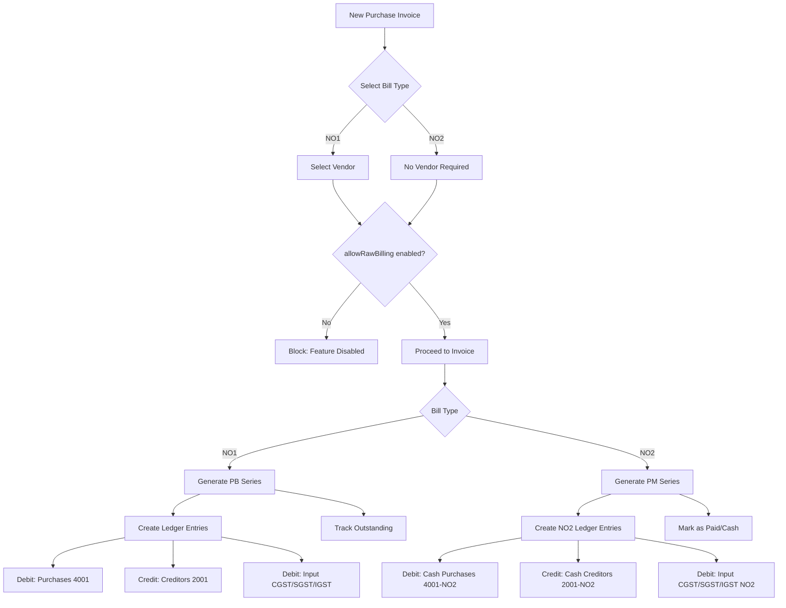

# Implementation Plan: Purchase NO1/NO2 Invoices with AllowRawBilling Toggle

## Overview

Extend the existing NO1/NO2 invoice pattern from Sales to Purchase, allowing outlets to toggle `AllowRawBilling` for purchase transactions. NO2 (Raw Cash Bills) will have separate accounting tracks without mixing with main accounts.

---

## Current State Analysis

### Sales Invoice Pattern (Reference Implementation)

| Feature             | NO1 (Invoice)                      | NO2 (Cash Memo)   |
| ------------------- | ---------------------------------- | ----------------- |
| Party Required      | ✅ Yes                             | ✅ Yes / ❌ No (use can add any name or select the party)   |
| Accounting Entries  | ✅ Created                         | ❌ Created in separate No.2 Raw account    |
| Invoice Series      | `INV/2025-26/0001`                 | `CM/2025-26/0001` |
| Credit Limit Check  | ✅ Applied                         | ❌ Skipped        |
| Outstanding Balance | ✅ Tracked                         | ❌ Not Tracked    |
| Toggle Gate         | `allowRawCashBills` outlet setting |

### Purchase Bill Current Flow

- Created from Purchase Order only
- Always requires vendor (party)
- Always creates accounting entries to Creditors (code 2001)
- No NO1/NO2 distinction
- No outlet-level toggle

---

## Target State: Purchase NO1/NO2

| Feature             | NO1 (Purchase Invoice)           | NO2 (Purchase Memo)                      |
| ------------------- | -------------------------------- | ---------------------------------------- |
| Vendor Required     | ✅ Yes                           | ✅ Yes / ❌ No (use can add any name or select the party)|
| Accounting Entries  | ✅ To main Creditors (2001)      | ❌ To separate Cash Creditors (2001-NO2) |
| Invoice Series      | `PB/2025-26/0001`                | `PM/2025-26/0001`                        |
| Credit Limit Check  | ✅ Applied                       | ❌ Skipped                               |
| Outstanding Balance | ✅ Tracked                       | ❌ Not Tracked                           |
| Toggle Gate         | `allowRawBilling` outlet setting | Same toggle                              |

---

## Implementation Steps

### Phase 1: Schema & Database

- [ ] **1.1 Rename Outlet Field**
  - Rename `allowRawCashBills` → `allowRawBilling` (unified for sales + purchase)
  - Create migration: `rename_allow_raw_cash_bills_to_allow_raw_billing.sql`

- [ ] **1.2 Add Separate Account Codes for NO2**
  - Add new system accounts per outlet:
    - `2001-NO2` → "Cash Creditors (Raw Bills)"
    - `4001-NO2` → "Cash Purchases (Raw Bills)"
    - `1005-NO2` → "Input CGST (Cash - Raw)"
    - `1006-NO2` → "Input SGST (Cash - Raw)"
    - `1007-NO2` → "Input IGST (Cash - Raw)"
  - Update account seed data to include these

- [ ] **1.3 Extend NumberingService**
  - Add `PURCHASE_INVOICE` type → prefix `PB`
  - Add `PURCHASE_MEMO` type → prefix `PM`
  - Add `DEBIT_NOTE` type → prefix `DN`
  ```typescript
  // src/domains/foundation/numbering-service.ts
  PURCHASE_INVOICE: "PB",
  PURCHASE_MEMO: "PM",
  DEBIT_NOTE: "DN",
  ```

### Phase 2: Backend Actions

- [ ] **2.1 Create `createPurchaseInvoice` Action**
  - Location: `src/actions/purchases/invoices.ts`
  - Accept `billType: "NO1" | "NO2"`
  - For NO2:
    - Skip vendor validation
    - Skip credit limit check
    - Use NO2 account codes for ledger entries
    - Generate `PURCHASE_MEMO` number
    - Set `isInformal: true`
    - No party association
  - For NO1:
    - Require vendor selection
    - Apply credit limit check
    - Use main account codes
    - Generate `PURCHASE_INVOICE` number

- [ ] **2.2 Add Purchase Invoice Listing**
  - Extend `getPurchaseInvoices` to filter by `billType`
  - Add bill type indicator in response

- [ ] **2.3 Create `getPurchaseInvoice` Action**
  - Single invoice detail with items, payments

- [ ] **2.4 Payment Handling for NO2**
  - Payments for NO2 purchase memos should auto-reconcile (cash transactions)
  - Immediate "PAID" status with `paidAt` timestamp

### Phase 3: UI Components

- [ ] **3.1 Update Outlet Edit Form**
  - Location: `src/app/dashboard/master-data/locations/outlet/[id]/edit/edit-client.tsx`
  - Rename `allowRawCashBills` → `allowRawBilling`
  - Add descriptive label: "Allow Raw/Cash Bills (Both Sales & Purchase)"
  - Add help text explaining the feature

- [ ] **3.2 Create Purchase Invoice Page**
  - Location: `src/app/dashboard/purchase/invoices/page.tsx`
  - List view with filter tabs: All | NO1 | NO2
  - Show bill type badge

- [ ] **3.3 Create Purchase Invoice Form**
  - Location: `src/app/dashboard/purchase/invoices/new/page.tsx`
  - Toggle Bill Type selector: NO1 | NO2
  - For NO1: Show vendor dropdown, credit limit display
  - For NO2: Show supplier name/phone fields (informal)
  - Product entry (same as existing)
  - Auto-calculate GST, totals

- [ ] **3.4 Purchase Invoice Detail View**
  - Location: `src/app/dashboard/purchase/invoices/[id]/page.tsx`
  - Display with appropriate formatting based on bill type
  - Print-friendly view

- [ ] **3.5 Update Sidebar Navigation**
  - Add "Purchase Invoices" under Purchase section
  - Move existing bills under "Purchase Bills" (from PO)

### Phase 4: Accounting Integration

- [ ] **4.1 Update Account Reports**
  - NO2 transactions should only affect NO2 accounts
  - Filter accounts by type in balance sheet

- [ ] **4.2 Vendor Ledger Updates**
  - NO2 transactions excluded from vendor ledger
  - Separate "Cash Creditors" ledger report

- [ ] **4.3 GST Reports**
  - Separate GST calculation for NO1 vs NO2
  - NO2 may be treated differently for tax compliance

### Phase 5: Testing & Documentation

- [ ] **5.1 Unit Tests**
  - Test NO1 creation with vendor
  - Test NO2 creation without vendor
  - Test NO2 blocked when toggle disabled
  - Test accounting entries for each type

- [ ] **5.2 Integration Tests**
  - Full flow: Create → View → Payment (for NO1)
  - Full flow: Create → Auto-Paid (for NO2)

---

## Account Code Structure

```
ASSETS (1xxx)
├── 1001 Cash
├── 1002 Bank
├── 1003 Debtors (Sales - NO1 only)
├── 1005 Input CGST
├── 1006 Input SGST
└── 1007 Input IGST
    └── NO2 variants: 1005-NO2, 1006-NO2, 1007-NO2

LIABILITIES (2xxx)
├── 2001 Creditors (Purchase - NO1 only)
│   └── 2001-NO2 Cash Creditors (Raw Bills)
├── 2002 Output CGST
├── 2003 Output SGST
└── 2004 Output IGST

INCOME (3xxx)
├── 3001 Sales (NO1 only)
│   └── 3001-NO2 Cash Sales (Raw Bills)

EXPENSES (4xxx)
├── 4001 Purchases (NO1 only)
│   └── 4001-NO2 Cash Purchases (Raw Bills)
├── 4002 Freight/Packing
└── 4003 Direct Expenses
```

---

## Mermaid: Transaction Flow



---

## Migration Script

```sql
-- Migration: Add AllowRawBilling toggle and NO2 Purchase accounts

-- 1. Rename field (Prisma handles this, but SQL fallback)
ALTER TABLE "Outlet"
RENAME COLUMN "allowRawCashBills" TO "allowRawBilling";

-- 2. Create NO2 accounts for each outlet
-- This will be handled by seed script
```

---

## Files to Create/Modify

| File                                                                       | Action | Purpose                   |
| -------------------------------------------------------------------------- | ------ | ------------------------- |
| `prisma/migrations/xxx_add_allow_raw_billing/migration.sql`                | Create | Rename field, add indexes |
| `src/domains/foundation/numbering-service.ts`                              | Modify | Add PB, PM document types |
| `src/actions/purchases/invoices.ts`                                        | Create | Invoice CRUD actions      |
| `src/app/dashboard/purchase/invoices/page.tsx`                             | Create | Invoice list page         |
| `src/app/dashboard/purchase/invoices/new/page.tsx`                         | Create | New invoice form          |
| `src/app/dashboard/purchase/invoices/[id]/page.tsx`                        | Create | Invoice detail            |
| `src/app/dashboard/master-data/locations/outlet/[id]/edit/edit-client.tsx` | Modify | Update toggle label       |
| `src/validations/purchase-invoice.validation.ts`                           | Create | Zod schema                |
| `src/components/ui/bill-type-selector.tsx`                                 | Create | Reusable component        |
| `src/__tests__/purchase-invoice.test.ts`                                   | Create | Unit tests                |
